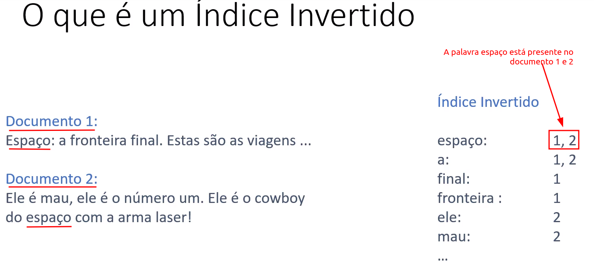
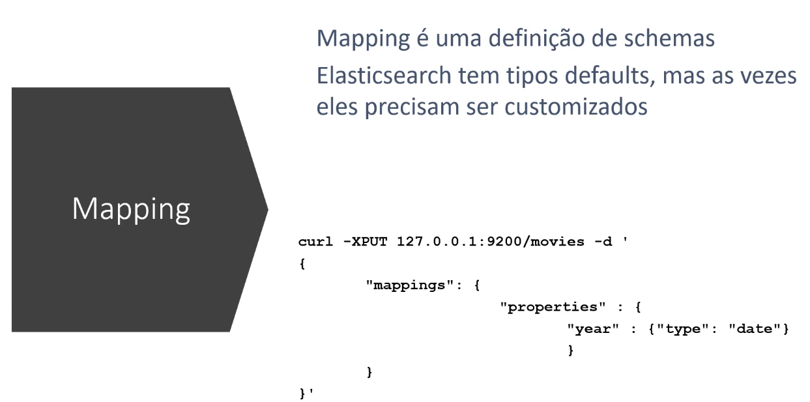
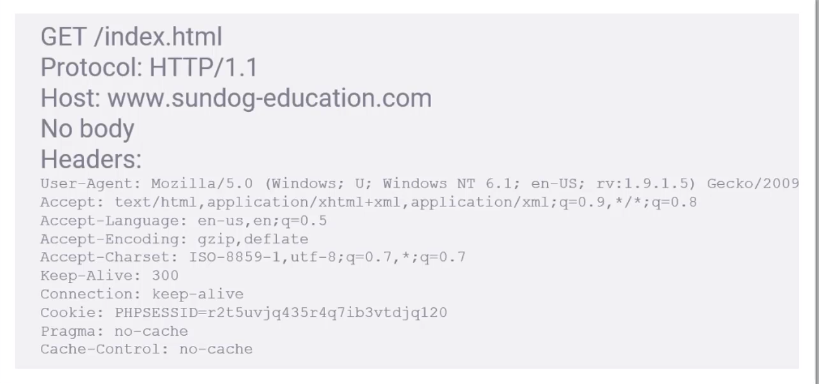
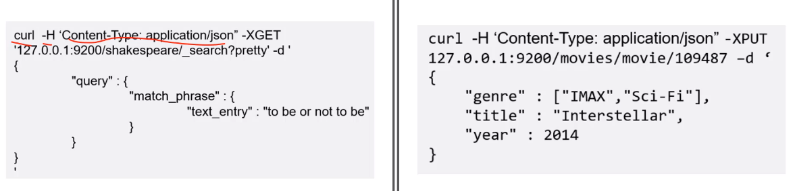

## ELASTIC SEARCH  

- O Elastic Search é muito mais de que uma ferramenta de busca
- Ele é um `ecosistema` de soluções
    - Kibana
    - LogStash/Beats
    - X-Pack
- Versão Escalavel do Lucene
- Escala Horizontalmente (Adiciona mais nodes ao Cluster)
- Cada Shard é um índice invertido de documentos.
- Além de busca:
    - Suporta dados estruturados
    - Pode agregar dados
    - É muito rápido
    - Tem suporte a machinelearning
- Suporta requisições em JSON

### KIBANA

- Interface Web para busca e visualização
- Agregações complexas, grafos, gráficos, criação de dashboards
- Muito utilizado para análise de logs

### Logstash/Beats

- Ingestão de dados no Elasticsearch
- Filebeat pode monitorar arquivos de Log, analisar e importar para o Elasticsearch near-real-time
- Logstash pode importar dados de vários computadores
- Não são usados apenas para dados de log

### X-Pack (Paga)

- Segurança
- Alertas
- Monitoramento
- Relatórios
- machine Learning
- Grafos

### Conteitos lógicos Elasticsearch   

#### Documentos E Índices

- Documentos são dados que você procura. Eles podem ser mais do que texto. Elasticsearch está estruturado em cima de `Json`. Todo documento tem um ID único e um tipo.
- Um índice potencializa a busca em todos os documentos de uma coleção. Eles contém um índice invertido, que permite que você faça a busca em tudo ao mesmo tempo.

- Fazendo uma analogia com o banco de dados tradicional:
    - O índice é como se fosse uma tabela em banco de dados(Tem uma coleção de documentos que fazer parte dele)
    - O Documento é como se fosse uma linha em uma tabela.

- Só podemos ter um tipo de documento em um mesmo índice em um documento.

Analogia:
- `Cluster` :Banco de dados
- `ìndices`: são as tabelas
- `Documentos`: São linhas nas tabelas

Embora temos essa analogia, o funcionamento do elastic não tem nada haver com banco de dados.   

### Índices invertidos

- É um mecanismo com qual ferramentas de buscas funcionam

  

- `TF-IDF`: Term Frequency * Inverse Document Frequency
- `Term Frequency`: frequência com que uma palacra aparece em um documento
- `Document Frequency` é a frequência com que um termo aparece em todos os documento
- `Relevância`: Term Frequency / Document Frequency, media em um documento.
  

### Como usamos índices do Elasticsearch?

- `Restful API`: Elasticsearch funciona atravṕes de requisições http e dados em JSON. Qualquer linguagem de programação pode fazer requisições e analisar o resultado.
- `API's clientes`: Muitas linguagens tem bibliotecas específicas para tornar o uso do Elasticsearch ainda mais fácil. PHP, PYTHON, JAVA.
- `Ferramentas Análíticas`: Interfaces Gráficas Web permitem que você consulte os índices e explore os dados sem precisar escrever código. Ex: Kibana

 

### Mapping  

- Mapping é uma definição de schemas Elastisearch tem tipos defaults, mas as vezes eles precisam ser customizados.
- Mapping: Ele diz ao elasticsearch como os dados devem ser armazenado, quais tipos de dados são, como indexar e analizar.
- O Elasticsearch tem os tipos defaults como: string, float ...

- No exemplo abaixo dizemnos ao elastic que a data de lançamento seja interpretada como texto e não como string ou caracteres, e isso é especificado atraves de um mapping. O atribute year é do tipo date

        "year": { type: "date" }

  

No exemplo acima temos:

- curl:que faz uma requisição HTTP
- -XPUT: Vamos colocar dados no indice
- 127.0.0.1:9200: Endereço elasticsearch
- movies: Nome do índice
- -d: nos diz que o que vem seguinte entre as aspas('') faz parte do corpo da requisição
- mappings: Dentro do corpo da requisição estamos passando um mapping, ou schema de dados, de como os dados vão ser armazenado.
- O corpo tem um sessão mapping que defini como o esse indice deve ser.
- year: estamos dizendo que o campo year seja interpretado como data e não como texto.

#### MAPPING MAIS COMUNS

- `Filed Types`: string, byte, short, integer, long, float, double, boolean, date
- `Field Index`: Você quer que este campo seja indexado para full-text-search?
- `Field Analyzer`: Define filtros, tokenizer, token filter

#### MAIS SOBRE ANALYZERS

- `Character filter`: Remove codificação HTML, converter & em e etc.
- `Tokenizer`: Dividir palavras em espaçoes, pontuação ou caracteres especiais
- `Token filter`: Letras minusculas, stemming(derivado(caixa, caixote)), sinônimos(apanhar, pegar), stopwords(a, para) palavras sem valores semânticos

### OPÇÕES DE ANALYZERS

- `Standard`: Divide em palavras, remove pontuação, transforma em letras minúsculas. Opção se o idioma é desconhecido.
- `Simple`: Divide em qualquer coisa que não seja uma letra e transforma em minúsculas.
- `Whitespace`: Divide em espaços mas não transforma em minusculas
- `Language: (ex. portuguese)`: Trata de questões específicas do idionam, como stopwords e stemming

### API Restful (Representation State Transfer)   

`Api Restful` nada mas é do requisições HTTP.  

- 1 - Arquitetura cliente servidor
- 2 - Statelessness(sem estado)
- 3 - Cachebility
- 4 - Layered
- 5 - Sob demanda
- 6 - Interface uniforme  

Estrutura de uma requisição:

- `Método`: o verbo da requisição: GET, POST, PUT ou DELETE
- `Protocolo`: qual a versão do http(http/1.1)
- `Host`: para qual servidor você quer enviar a requisição
- `URL`: quais recursos estão sendo solicitados
- `Body`: outros dados necessários
- `Headers`: user-agente, content-type etc.

  

### CURL

Forma de enviar requisições HTTP na linha de comando

    curl -H "Content-Type: application/json" <URL> -d '<BODY>'

#### Exemplo de requisição usando CURL

  